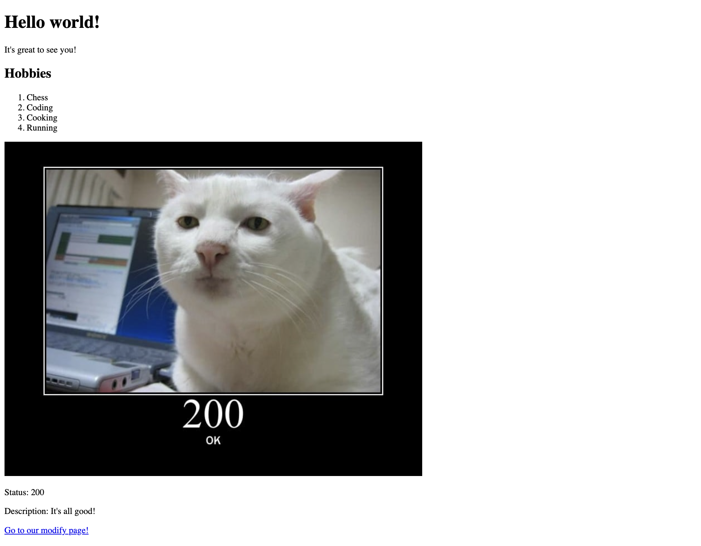
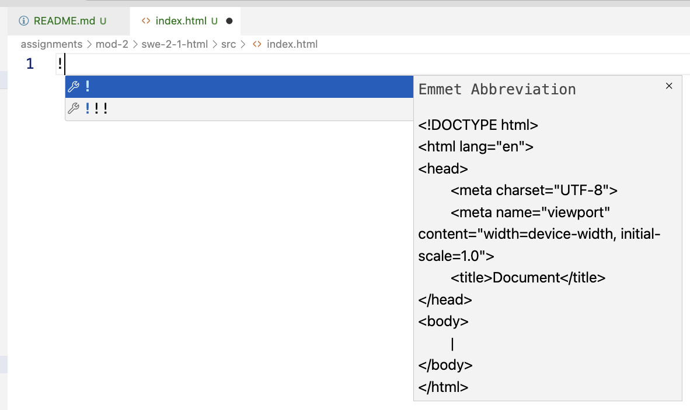

# Intro To HTML

- [Getting started](#getting-started)
- [Before you start](#before-you-start)
- [Testing](#testing)
- [From Scratch](#from-scratch)
  - [Question 1 - head and title](#question-1---head-and-title)
  - [Question 2 - body with main](#question-2---body-with-main)
  - [Question 3 - add an H1](#question-3---add-an-h1)
  - [Question 4 - Add a p tag](#question-4---add-a-p-tag)
  - [Question 5 - Add an h2 and ordered list](#question-5---add-an-h2-and-ordered-list)
  - [Question 6 - add some classes](#question-6---add-some-classes)
  - [Question 7 - div for status code info](#question-7---div-for-status-code-info)
  - [Question 8 - an img](#question-8---an-img)
  - [Question 9 - add some spans](#question-9---add-some-spans)
  - [Question 10 - add an anchor tag](#question-10---add-an-anchor-tag)
- [Modify](#modify)
  - [Semantic Elements](#semantic-elements)
  - [Too many h1s](#too-many-h1s)

We're going to be creating an `index.html` document and making our `modify.html` more accessible by! Let's go!

## Getting started

For guidance on setting up and submitting this assignment, refer to the Marcy lab School Docs How-To guide for [Working with Short Response and Coding Assignments](https://marcylabschool.gitbook.io/marcy-lab-school-docs/fullstack-curriculum/how-tos/working-with-assignments#how-to-work-on-assignments).

After cloning your repository, make sure to run the following commands:

```sh
npm i
git checkout -b draft
npm t
```

## Before you start
Be careful with spacing and capitalization! the tests are *exact* when they look for things like classes and text content.

For example, if we want you to create a bit of text that says `Hello world`, there are a lot of ways to achieve this

```html
<!-- Bad, no spaces -->
<p><span>Hello</span>world</span></p> 

<!-- Bad, collapses too many spaces. May produce the right output but fails tests. -->
<p><span>Hello </span> world</span></p> 

<!-- Works -->
<p><span>Hello </span>world</span></p> 

<!-- Also works -->
<p><span>Hello</span> world</span></p> 
```

Will output the following:

```plaintext
Helloworld
Hello world
Hello world
Hello world
```

Remember that HTML collapses white space, See example above.

## Testing

The tests are exact because they will be in real life! Just always check the spacing, capitalizations and spelling! Front end testing can be a frustrating experience because it might look right to you, a human, but a robot will harshly judge any minor mistake.

Be sure you're checking the tests to see exactly what they're looking for (always trust the test above all else, even this README). They're using some DOM manipulation and CSS selectors, you'll learn about those soon. That may confuse you, so focus on checking what text it's searching for with things like `textContent` and `id` names.

```js
const p = document.querySelector('main p#subtitle');
```

And a quick heads up, that `.querySelector()` is using a CSS selector `p#subtitle`, which means a `p` tag with an id of `subtitle`. As you'll learn, CSS selectors are expressions that let us target one or more HTML elements in a document.

Here's a quick crash course:

| Selector Type | Syntax              | Example             | Explanation                                            |
| ------------- | ------------------- | ------------------- | ------------------------------------------------------ |
| Tag Type      | `'element'`         | `'p'`               | Select all of the `<p>` elements                       |
| Class         | `'.className'`      | `'.info'`           | Select all elements with `class="info"`                |
| ID            | `'#idName'`         | `'#navbar'`         | Select the element with `id="navbar"`                  |
| Combination   | `'element#id.class` | `'div#navbar.info'` | Select the `div` with `class="info"` and `id="navbar"` |

## From Scratch

Let's practice writing some HTML! By the end of this From Scratch section, you will have the following website:



### Question 1 - head and title
OK! We're starting with a blank `index.html` file! Go ahead and add the basic starting elements for HTML files. You can do this by typing in `!` and hitting enter once the **Emmet Abbreviation** shows up:



To pass this test, you need to have a `head` tag with a `title` tag that has the text content `Intro to HTML`. 

Remember, the `head` tag is for metadata about our page, like the `title`, which sets the tab text in your browser. Users really appreciate good titles! As we build this website, you may want to view the result! Use the command below to open up your `.html` file in your browser!

```sh
open src/index.html
```

Then, test your code:

```sh
npm test
```

### Question 2 - body with main

To pass this test, you need to have a `body` tag below your `head` tag. Inside the `body` put a `main` tag. 

> `main` is a special *semantic* element that tells our page where our main content is, as opposed to our header, navigation or footer. Think of it like a special `div`. It's great, please always use a `main` tag for your primary content! All our tags in this `index.html` will be in `main`.

### Question 3 - add an H1
Every page should have 1 primary `h1` tag, so let's do that! 

Inside of `main`, create an `h1` as the first child of our `main` tag, and give it a text content of `Hello world!`. Check your spelling and punctuation!

### Question 4 - Add a p tag
Ok, so now for a subtitle. As the sibling of `h1` (right next to and under, not nested), create a `p` tag. Give this `p` tag an id of: `subtitle` and a text content of: `It's great to see you!`.

### Question 5 - Add an h2 and ordered list
Let's rank our hobbies! Add an `h2` (`h2` because the other heading was an `h1`, and our sub sections shouldn't ever jump headings, so `h3` would be wrong). The `h2` should say `Hobbies`.

Now add an ordered list (is that `ol` or `ul`?) and in this ordered list add `li` elements with these text contents, in this order:

1. Chess
2. Coding
3. Cooking
4. Running

Do you need to add the numbers...or is that given to us for free by the ordered list tag? The list tag needs to have an `id` attribute of `"hobbies"`.

### Question 6 - add some classes
Ids should be unique, but you can repeat class names, so lets try that. On only the `Chess` and `Coding` `li`s, add a class attribute of `nerd`.

> Remember: class names can (and should) be repeated across the page, but each element can have no more than one `class` attribute! If you want multiple classes on a single element (and you will soon), then you just space separate them. Separating by spaces is the reason that all class names MUST NOT include spaces.

```html
<p class="primary">Good!</p>
<p class="primary">Good!</p>
<p class="primary" class="secondary-text">NO!!</p>
<p class="primary secondary-text">Good!</p>
```

### Question 7 - div for status code info
Let's make a little div with information on our http status codes. It doesn't matter if you don't know what a status code is yet, just follow the prompts, just a fun little look ahead!

Anyway, make a `div` in `main` that has an id of `status-code-info`.

### Question 8 - an img
Now, in that `div` we just made, add a child `img` tag. It's going to have a `src` attribute of: `https://http.cat/images/200.jpg`, and an `alt` attribute of: `A weird looking cat that exudes good vibes.` The image is going to appear huge, that's ok! We'd normally fix that with CSS, but we aren't worried about that today. `alt` tags are required if your image is central content to the page. It describes the image to screen readers and search bots. SUPER IMPORTANT!

### Question 9 - add some spans
Ok, now still in this `div`, under the `img` let's add two `p` tags. The text content for them are:

```plaintext
Status: 200
```
and

```plaintext
Description: It's all good!
```

But here's the catch, and be careful! Put a `span` with a class of `fancy` around `Status:` and `Description:` (include colons, don't include spaces). That means that the `span`s will be child tags of the `p` tags, right in the middle of the text! Here's an example:

```html
<p>This is <span>valid</span> text!</p>
```

> NOTE: Could we have used a `figure` tag to do this *even* more accessibly? Don't change it here (the tests aren't looking for that), but research it on your own!

### Question 10 - add an anchor tag
Now let's add a link as the last element of `main`. It will link to our other page, `modify.html`. To do this add an `a` tag with an `href` of `./modify.html`. Its text content should read `Go to our modify page!`. Also, I'd like my link to open in a new tab, and luckily that's super easy. Add a `target` attribute to the `a` tag with a value of `_blank`. This isn't always what we want, but it's a good trick to know!

## Modify
OK! With your `index.html` done, let's work on `modify.html`. This page is actually mostly fine, it's just not very accessible because of some small errors.

Use `npm test` to confirm that you've made the correct modifications!

### Semantic Elements
`modify.html` is using a bunch of divs with ids. That's very old school, we have better tools now! Replace the divs and their ids with the new tags. MAKE SURE TO REPLACE BOTH THE OPENING AND CLOSING TAGS!

```html
<!-- Example -->
<div id="main">
</div>

<!-- Should be: -->
<main>
</main>
```

- `main` - This is a semantic element that tells screen readers where the main content of the page is. We just used it, now use it again!
- `header` - NOT THE `head` TAG! The `header` is like the top, simple section of the page, very often it has things like logos and main navigation
- `nav`  - These contain links to the rest of our page. The links should be stored in a list (the `ul` is correct in `modify.html` for example). But the parent of the `ul` of links should always be a `nav` element.
- `footer` - the footer is the repeated bottom of the page that you've seen. Very often it has a bunch more links or copyright information. Here we're just using a `p` tag, but you get the idea.
- `pre` - this is "preformatted" tag, and it's real neat! Ordinarily HTML doesn't respect white space and will collapse newlines and tabs. But not with the `pre` tag. In this example, when you switch the div, notice what happens to the spacing. `pre` is almost always used with...
- `code` - If you ever want to include a code snippet, you should use the `code` tag. You can style these tags soon, but it's not about looks yet.

"Semantic" tags, unlike "non-semantic" tags, tell the browser and screen readers information about the *content* of the tag. It may not appear any different visually, but it's not about that. It's about making web pages that everyone can enjoy and bots can understand easily. Make Marcy proud, make accessible pages!

### Too many h1s
There should be only one `h1` on a page, but we have two! Think about the hierarchy of the *existing* `h` tags, and fix the level of the second heading. Should it be an `h1, h2, h3, h4, h5, or h6`? Don't add any tags, just edit one of the existing tags to be different!
